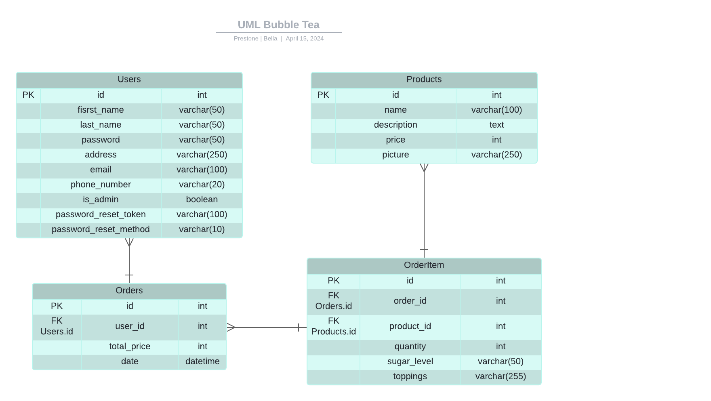

# Groupe de ozdami_b 1035030

## Le fichier des dépendances est le suivant : 
requirements.txt générer par la commande suivante : pip freeze > requirements.txt

Après avoir fait un pull il faut exécuter la commande : pip install -r requirements.txt
pour installer toutes les dépendances du projet 

===========

